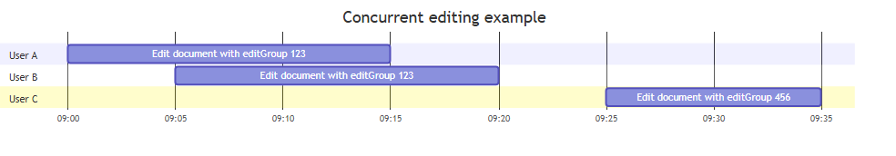

# ONLYOFFICE Connector

The [ONLYOFFICE](https://onlyoffice.com) Connector enables inline editing of common office documents such as Word, Excel, and PowerPoint by integrating the ONLYOFFICE Document Server with Axon Ivy. It allows users to edit documents directly inside the application workflow without leaving the process context. For a list of supported Office file formats, please visit https://api.onlyoffice.com/docs/docs-api/usage-api/config/document/.

Please visit [ONLYOFFICE Docs](https://onlyoffice.com/docs) for the FAQ and downloads.

### ONLYOFFICE API

The implementation of this connector is based on the [ONLYOFFICE document editor API](https://api.onlyoffice.com/docs/docs-api/usage-api/doceditor/).

To use this connector, add the `OnlyOfficeScript` and `OnlyOfficeEditor` components to your XHTML page. Since the `OnlyOfficeScript` component loads the editor script into the DOM tree, it should be loaded independently of any other page logic before the `OnlyOfficeEditor` is displayed.

The `OnlyOfficeEditor` takes four parameters:

editGroup
: If you want to allow simultaneous editing of a single document by multiple users, make sure that all of them use the same `editGroup`. Please note that once every user stopped editing the document, it is no longer possible to re-use the `editGroup` for another editor (otherwise you will see a "Version has been changed error"). This is a documented requirement of ONLYOFFICE.

documentId
: The ID of a document that allows the `OnlyOfficeDocumentHandler` to load and save the file. In the demo, the UUID of an Ivy document is used as the ID. If your documents are stored in a database, this may be the primary key of the database record.

fileName
: The name of the file being edited as displayed in the editor.

configuration
: A JSON block that can be used to adapt the default configuration. The default configuration covers the document key, type, and name and also sets the current user's name and locale. Information supplied here takes precedence. For example, if you pass another username, it overrides the automatically set username.

### Host your own documents and implement your own `OnlyOfficeDocumentHandler`

Host your own documents and provide them via the ONLYOFFICE Document Server for collaborative editing.

The connector uses a handler to load and save a document. A default handler (`com.axonivy.connector.onlyoffice.documenthandler.OnlyOfficeIvyDocumentHandler`) is provided and uses Axon Ivy's native documents. A custom handler for loading and saving files can be created by implementing the interface `com.axonivy.connector.onlyoffice.documenthandler.OnlyOfficeDocumentHandler`. Custom handlers need to be registered through a subprocess using the signature `OnlyOfficeDocumentHandler provideOnlyOfficeDocumentHandler()` (see the demo for an example). This subprocess is called when a handler is needed for the first time.

### Caveats

#### Document edit groups

When you want to enable simultaneous editing for multiple users, all must use the same `editGroup`. In general, when the last user leaves editing the document, the `editGroup` cannot be used again, otherwise the error "The version has been changed" will be displayed and it will not be possible to edit the document.

If you want to allow for simultaneous editing, you must make ensure, that no editor can enter an already closed edit group. This is best done in a project specific `OnlyOfficeDocumentHandler` where you can cleanup edit groups when no user is editing the document.

#### Asynchronous saving

Automatic saving is enabled by default and is asynchronous. Saving is usually executed only after the page is closed or left. In Axon Ivy, this usually happens at the next task switch or when the process ends. There is also a way to request an immediate save by calling `OnlyOfficeService.get().callForcesave(key, userdata)`.

If you do not want autosave, the editor configuration can be used to disable `autosave` and enable `forcesave`:

```json
{
  "editorConfig": {
    "customization": {
      "autosave": false,
      "forcesave": true
    }
  }
}
```

Nevertheless, a save is never synchronous and may be delayed by a few seconds. If you depend on the saved version of a document immediately after editing, you need to wait until the document has finished saving. A document is considered finished/saved when the save method of the `OnlyOfficeDocumentHandler` is called with the `last` flag set to `true`.

## Demo

The demo illustrates a collaboration scenario in which one user uploads a document as the author, edits it, and selects it for the next step. Afterwards, a reviewer and a compliance officer each receive a task to work on the same document. They can then make their updates simultaneously.


The process starts when the document is selected from the Axon Ivy workflow context. The user chooses the file to be opened in the ONLYOFFICE editor.


Once the document is opened, the user can edit it directly in the integrated editor. This is the central benefit of the connector: document editing happens inline within the business process without interrupting the user flow.


After the author completes the initial editing step, the document is handed over to the next participants. A reviewer and a compliance representative each receive the relevant task and continue the same workflow on the same document.


The demo highlights the connector’s core collaboration model: multiple users can work on the same document at the same time, supporting parallel review and rework within a single end-to-end process.

### Example of a collaborative `OnlyOfficeDocumentHandler`

The demo uses its own `OnlyOfficeDocumentHandler`. This document handler asynchronously reacts to callback events with status `2` (the last user closed the document editor and the document needs saving) or `4` (the last user closed the document editor, but there were no changes). When such an event is received, the cached document `editGroup` is cleared so that the next editor has to create a new one. This prevents users from trying to re-enter an already dismissed `editGroup`.

In this example, **User A** and **User B** edit the same document at the same time using the same cached document `editGroup` **123**, which was created when **User A** started editing. Both users finish editing and close the editor. The document `editGroup` **123** is then cleared from the cache. Later, **User C** starts editing, and a new document `editGroup` **456** is created.



## Setup

To set up the connector, you need access to an ONLYOFFICE Document Server. The demo project includes a `docker-compose` setup for this purpose. You can start the Docker server by changing into the directory containing the `compose.yaml` file and executing the command:

`docker-compose up`

Alternatively, the standalone installation can be downloaded directly from ONLYOFFICE.

Please set the global variables according to their description. If you are using the provided demo Docker container, make sure that the password in `compose.yaml` matches the password set in the global variables. The password must be at least 32 characters long.

```
@variables.yaml@
```
