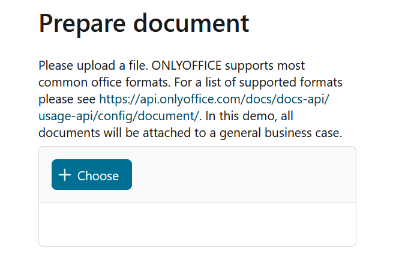
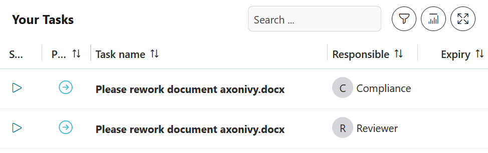
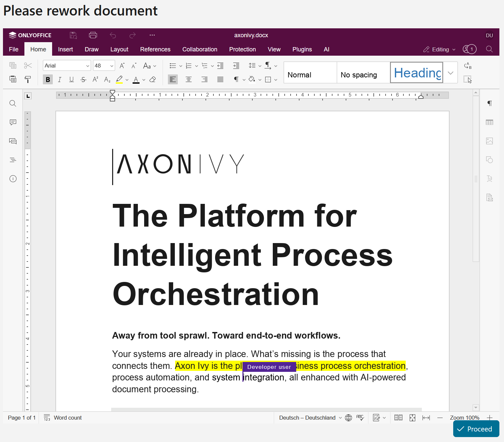

# ONLYOFFICE Connector

The [ONLYOFFICE](https://onlyoffice.com) Connector enables inline editing of typical office documents (Word, Excel, Powerpoint) by integrating the ONLYOFFICE Document Server with Axon Ivy. The purpose is to allow users to edit documents directly inside the application workflow without leaving the process context. For a list of supported Office file formats please visit https://api.onlyoffice.com/docs/docs-api/usage-api/config/document/.

Please visit [ONLYOFFICE Docs](https://onlyoffice.com/docs) to see the FAQ and downloads.

### ONLYOFFIC API

The implementation of this connector is based on the [ONLYOFFICE document editor API](https://api.onlyoffice.com/docs/docs-api/usage-api/doceditor/).

To use this connector, add the `OnlyOfficeScript` and the `OnlyOfficeEditor` components to your xhtml page. As the `OnlyOfficeScript` component contains the loading of the editor script into the Dom tree it should be loaded independently of any other page logic to display the `OnlyOfficeEditor`.

The `OnlyOfficeEditor` takes 4 parameters:

editGroup
: If you want to allow simultaneous editing of a single document by multiple users, make sure, that all of them get the same `editGroup`. *Please note, that every changing and then closing/opening of the editor in the same browser for the same document must occur with a different edit group*. This is a documented requirement of ONLYOFFICE. If you change a document, then close the editor (e.g. by leaving the page) and then opening the editor again, you will get a "version has been changed" error.
* documentId
: The id of a document which allows the `OnlyOfficeDocumentHandler` to load and save the file. In the demo, the UUID of an Ivy document will be used as the id. If you keep your documents in a database, it might be the primary key of the database record.
* fileName
: The name of the file beeing edited to display in the editor.
* configuration
: A JSON block that can be used to adapt the default configuration. The default configuration covers the document key, type and name and also sets the current users name and locale. Information added here will have precedence. I.e. if you pass another user
name, then this will override the automatically set username.

### Host your own documents, implement your own `OnlyOfficeDocumentHandler`

Host your own documents and provide them via the ONLYOFFICE document server for collaborativ editing.

The connector uses a handler to load and save a document. A default handler is provided
and uses AxonIvy's native documents. A custom handler for loading and saving files can be created by implementing the interface `com.axonivy.connector.onlyoffice.documenthandler.OnlyOfficeDocumentHandler`. Own handlers need to be registered through a subprocess using the signature `OnlyOfficeDocumentHandler provideOnlyOfficeDocumentHandler()` (see the demo for an example). This sub-process will be called when a handler is needed for the first time.

### Caveats

As mentioned before, every opening of an editor in the same browser requires a unique `editGroup`, otherwhise the error "The version has been changed" will be displayed and it will not be possible to edit a document.

Automatic saving is default and asynchronous. Saving is usually executed only after the page is closed/left. In AxonIvy this usually happens at the next task switch or when the process ends. There is also a way to request an immediate save by calling `OnlyOfficeService.get().callForcesave(key, userdata)`. 

If you do not like autosave, the editor configuration can be used to disable autosave and enable forcesave:

```json
{
    "editorConfig": {
        "customization": {
            "autosave" = false;
            "forcesave" = true;
        }
    }
}
```

Nevertheless, in any case a save is never synchronous but might be delayed for a few seconds. If you depend on the saved version of a document immediately after editing you need to implement some kind of waiting for the document to finish. A document will be finished/saved, when the save method of the `OnlyOfficeDocumentHandler` is called with the `last` flag set to `true`.

## Demo

The demo shows a collaboration scenario in which one user uploads a document as the author, edits it, and selects it for the next step. Afterwards, a reviewer and a compliance officer each receive a task to work on the document. They can perform their updates simultaneously.



The process starts with selecting the document from the Axon Ivy workflow context. The user chooses the file that should be opened in the ONLYOFFICE editor.


Once the document is opened, the user can edit it directly in the integrated editor. This is the central benefit of the connector: document editing happens inline within the business process, without breaking the user flow.



After the author completes the initial editing step, the document is handed over to the next participants. A reviewer and a compliance representative each receive the relevant task and continue the same workflow with the same document.



The demo highlights the core collaboration model of the connector: multiple users can work on the same document at the same time, which supports parallel review and rework inside one end-to-end process.

## Setup

To setup the connector you need access to an ONLYOFFICE Document Server. The demo project includes a `docker-compose` setup for this purpose. You can start the docker server by changing into the directory containing the `compose.yaml` file and executing the command

`docker-compose up`

Alternatively, the standalone installation can be downloaded directly from ONLYOFFICE.

Please set the global variables following their description. If you are using the provided demo docker container, make sure, that the password set in the `compose.yaml` file matches the password set in the global variables. The password must be at least 32 characters long.

```
@variables.yaml@
```
